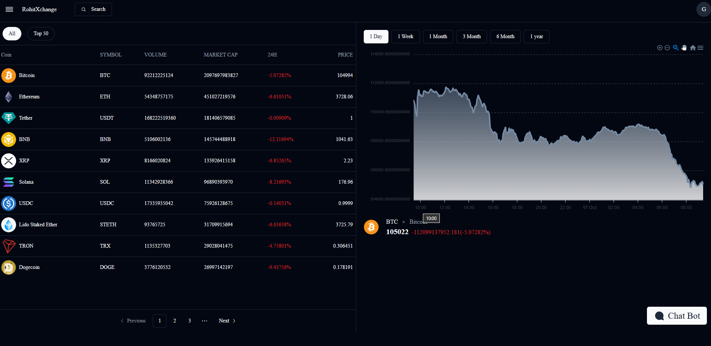
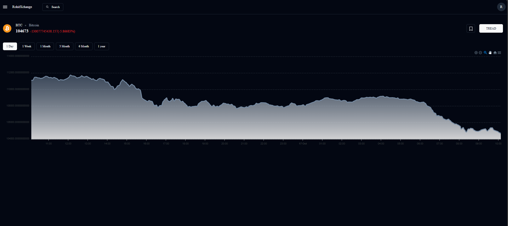
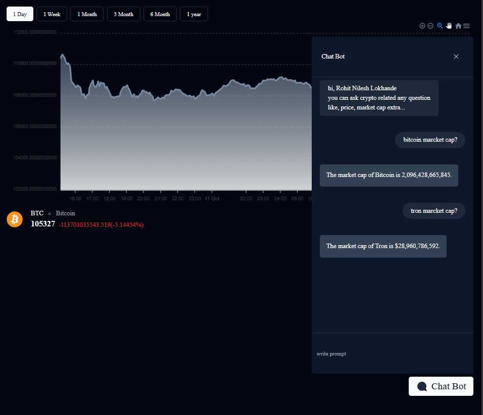
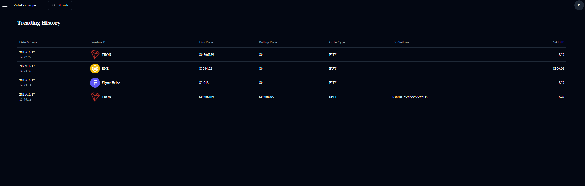
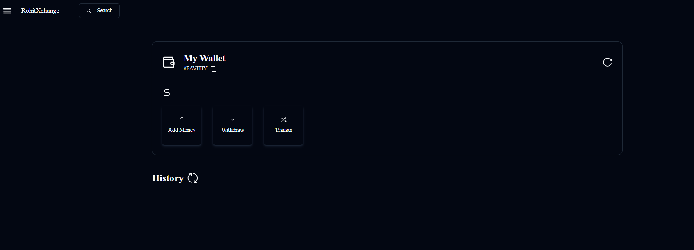
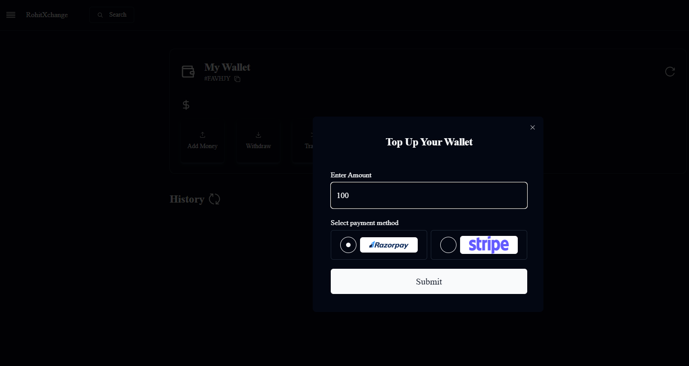
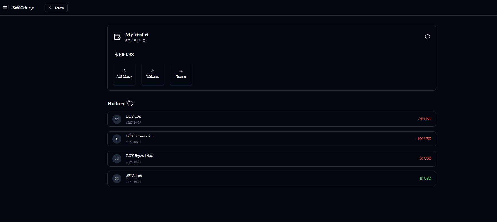
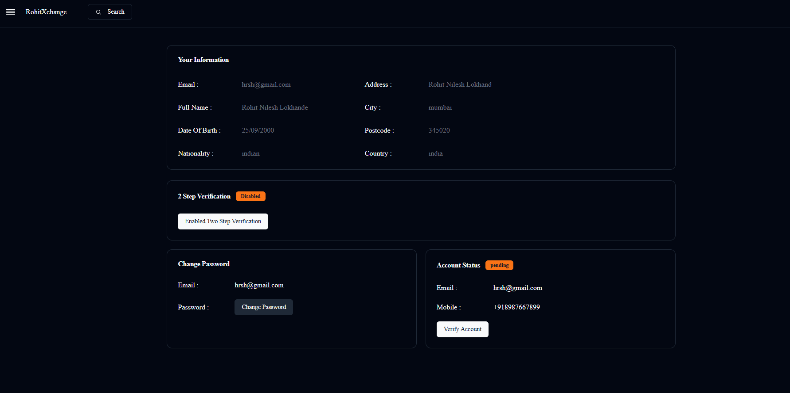

# 💎 RohitXchange - Cryptocurrency Trading Platform

<div align="center">


**A full-stack cryptocurrency trading platform with real-time market data, wallet management, and AI-powered assistance**

[](https://rohit-xchange-frontend.vercel.app/)
[](https://github.com/Rohit6168/RohitXchangeFrontend)
[](https://reactjs.org/)
[](https://vercel.com/)

</div>

---

## 📋 Table of Contents

- [Overview](#-overview)
- [Features](#-features)
- [Tech Stack](#-tech-stack)
- [Screenshots](#-screenshots)
- [Getting Started](#-getting-started)
- [Project Structure](#-project-structure)
- [API Integration](#-api-integration)
- [Payment Gateway](#-payment-gateway)
- [Contributing](#-contributing)
- [License](#-license)
- [Contact](#-contact)

---

## 🌟 Overview

RohitXchange is a modern cryptocurrency exchange platform that enables users to trade digital assets with real-time market data. The platform provides a seamless trading experience with secure wallet management, multiple payment options, and an AI chatbot for user assistance.

### 🎯 Key Highlights

- 📊 **Real-time Market Data** - Live cryptocurrency prices and charts
- 🔒 **Secure Wallet System** - Digital wallet with transfer capabilities
- 🤖 **AI-Powered Support** - Intelligent chatbot for user assistance
- 💳 **Multiple Payment Options** - Razorpay and Stripe integration
- ✉️ **Email Verification** - OTP-based secure authentication
- 📱 **Responsive Design** - Works seamlessly across all devices

---

## ✨ Features

### 🔐 Authentication & Security
- ✅ **User Registration** with email verification
- 🔑 **OTP-based Authentication** for enhanced security
- 🛡️ **Two-Factor Authentication (2FA)** support
- ⚡ **Account Status Management** (Pending/Verified)
- 🔒 **Secure Password Management**

### 💰 Wallet Management
- 👛 **Personal Digital Wallet** with unique wallet ID
- 💵 **Add Funds** via Razorpay or Stripe
- 🏦 **Withdraw Funds** to bank account
- 🔄 **Wallet-to-Wallet Transfers** using wallet ID
- 📜 **Transaction History** with real-time updates
- 💹 **Balance Tracking** in multiple currencies

### 📈 Trading Features
- 💱 **Buy & Sell Cryptocurrencies**
  - ₿ Bitcoin (BTC)
  - Ξ Ethereum (ETH)
  - ₮ Tether (USDT)
  - 🔶 Binance Coin (BNB)
  - ✖️ XRP
  - ◎ Solana (SOL)
  - 💵 USDC
  - ➕ And many more...
- 📊 **Real-time Price Charts** with multiple timeframes (1 Day, 1 Week, 1 Month, 3 Month, 6 Month, 1 Year)
- ⚡ **Market Order Execution**
- 📝 **Trading History** with profit/loss tracking
- 📁 **Portfolio Management**
- ⭐ **Watchlist** for favorite cryptocurrencies

### 💳 Payment Integration
- 🟦 **Razorpay Integration**
  - 📱 UPI Payment Support
  - 💳 Credit/Debit Card Payments
  - 🏦 Net Banking
- 🟪 **Stripe Integration**
  - 🌍 International Card Support
  - 🔐 Secure Payment Processing
- 🧪 **Test Mode** for safe development

### 🤖 AI Chatbot
- 💬 **Intelligent Assistant** for platform navigation
- 🌐 **24/7 Availability** for user queries
- 📈 **Trading Guidance** and market insights
- 🆘 **Account Support** and troubleshooting

### 📊 Dashboard Features
- 🏆 **Top 50 Cryptocurrencies** with live data
- 📈 **Market Statistics** (Volume, Market Cap, 24h Change)
- 💹 **Price Tracking** with historical data
- 🎨 **Interactive Charts** powered by Recharts
- 🔍 **Search Functionality** for quick coin lookup
- 📄 **Pagination** for easy navigation

### 👤 User Profile
- 📝 **Personal Information Management**
  - 👨‍💼 Full Name
  - 📧 Email Address
  - 🎂 Date of Birth
  - 🌍 Nationality
  - 🏙️ Country & City
  - 📍 Address & Postcode
- ⚙️ **Account Settings**
  - 🔑 Password Change
  - 🔐 Two-Step Verification Toggle
  - ✅ Account Verification Status
- 💳 **Payment Details** management

---

## 🛠 Tech Stack

### Frontend


- ⚛️ **React 18** - UI library
- ⚡ **Vite** - Build tool for faster development
- 🎨 **Tailwind CSS** - Utility-first CSS framework
- 🧭 **React Router** - Client-side routing
- 🎭 **Lucide React** - Modern icon library
- 📊 **Recharts** - Charting library for data visualization
- 🌐 **Axios** - HTTP client for API requests

### Backend


- 🍃 **Spring Boot 3.x** - Backend framework
- 🔒 **Spring Security** - Authentication & authorization
- 💾 **Spring Data JPA** - Database operations
- 🗄️ **MySQL** - Relational database
- 🎫 **JWT** - Token-based authentication
- 📧 **JavaMail** - Email service for OTP

### Payment Gateways


- 🇮🇳 **Razorpay API** - Indian payment gateway
- 🌍 **Stripe API** - International payment processing

### Deployment


- ▲ **Vercel** - Frontend hosting and deployment
- 🔄 **CI/CD** - Automated deployment pipeline

---

## 📸 Screenshots

### 🔐 Authentication
<table>
  <tr>
    <td><br/><b>Sign Up Page</b></td>
    <td><br/><b>Login Page</b></td>
  </tr>
</table>

### 📊 Dashboard & Trading
<table>
  <tr>
    <td><br/><b>Main Dashboard</b></td>
    <td><br/><b>Real-time Price Chart</b></td>
  </tr>
  <tr>
    <td><br/><b>AI chatbot</b></td>
    <td><br/><b>Trading History</b></td>
  </tr>
</table>

### 💰 Wallet Management
<table>
  <tr>
    <td><br/><b>Wallet Dashboard</b></td>
    <td><br/><b>Add Money Modal</b></td>
  </tr>
  <tr>
    <td><br/><b>Payment Successful</b></td>
    <td><br/><b>Updated Balance</b></td>
  </tr>
</table>

### 👤 User Profile & Settings
<table>
  <tr>
    <td><br/><b>User Profile</b></td>
    <td><br/><b>Navigation Sidebar</b></td>
  </tr>
</table>

---

## 🚀 Getting Started

### Prerequisites

- 💻 **Node.js** (v18 or higher)
- ☕ **Java JDK** (v17 or higher)
- 🗄️ **MySQL** (v8 or higher)
- 📦 **Maven** (v3.6 or higher)
- 🔧 **Git**

### Frontend Setup

1. **📥 Clone the repository**
   ```bash
   git clone https://github.com/Rohit6168/RohitXchangeFrontend.git
   cd RohitXchangeFrontend
   ```

2. **📦 Install dependencies**
   ```bash
   npm install
   ```

3. **⚙️ Configure environment variables**
   
   Create a `.env` file in the root directory:
   ```env
   VITE_API_BASE_URL=http://localhost:8080/api
   VITE_RAZORPAY_KEY=your_razorpay_key
   VITE_STRIPE_PUBLIC_KEY=your_stripe_public_key
   ```

4. **🚀 Start development server**
   ```bash
   npm run dev
   ```

5. **🏗️ Build for production**
   ```bash
   npm run build
   ```

### Backend Repository

The backend for this project is maintained in a separate repository:

**🔗 Backend Repository:** [RohitXchangeBackend](https://github.com/Rohit6168/RohitXchangeBackend)

Please refer to the backend repository for setup instructions and API documentation.

---

## 📁 Project Structure

```
RohitXchangeFrontend/
├── public/
│   └── assets/
├── src/
│   ├── components/
│   │   ├── Auth/
│   │   │   ├── SignUp.jsx
│   │   │   └── Login.jsx
│   │   ├── Dashboard/
│   │   │   ├── CoinList.jsx
│   │   │   └── PriceChart.jsx
│   │   ├── Wallet/
│   │   │   ├── WalletDashboard.jsx
│   │   │   ├── AddMoney.jsx
│   │   │   └── Transfer.jsx
│   │   ├── Trading/
│   │   │   ├── TradeModal.jsx
│   │   │   └── TradeHistory.jsx
│   │   ├── Profile/
│   │   │   └── UserProfile.jsx
│   │   └── Common/
│   │       ├── Navbar.jsx
│   │       ├── Sidebar.jsx
│   │       └── ChatBot.jsx
│   ├── pages/
│   ├── services/
│   │   ├── api.js
│   │   ├── authService.js
│   │   ├── walletService.js
│   │   └── tradingService.js
│   ├── utils/
│   ├── App.jsx
│   └── main.jsx
├── .env
├── package.json
├── vite.config.js
└── tailwind.config.js
```

---

## 🔌 API Integration

### 🔐 Authentication Endpoints
```javascript
POST   /api/auth/signup          - 📝 User registration
POST   /api/auth/login           - 🔑 User login
POST   /api/auth/verify-otp      - ✅ OTP verification
GET    /api/auth/user            - 👤 Get user details
```

### 💰 Wallet Endpoints
```javascript
GET    /api/wallet               - 👛 Get wallet details
POST   /api/wallet/deposit       - 💵 Add funds
POST   /api/wallet/withdraw      - 🏦 Withdraw funds
POST   /api/wallet/transfer      - 🔄 Transfer to another wallet
GET    /api/wallet/transactions  - 📜 Get transaction history
```

### 📈 Trading Endpoints
```javascript
GET    /api/coins                - 💎 Get all cryptocurrencies
GET    /api/coins/{id}           - 🔍 Get specific coin details
POST   /api/trade/buy            - 📈 Buy cryptocurrency
POST   /api/trade/sell           - 📉 Sell cryptocurrency
GET    /api/trade/history        - 📊 Get trading history
GET    /api/portfolio            - 📁 Get user portfolio
```

### 💳 Payment Endpoints
```javascript
POST   /api/payment/razorpay/create  - 🟦 Create Razorpay order
POST   /api/payment/stripe/create    - 🟪 Create Stripe session
POST   /api/payment/verify           - ✅ Verify payment
```

---

## 💳 Payment Gateway

### 🟦 Razorpay Integration

RohitXchange uses Razorpay for domestic (Indian) payments:

**✨ Supported Payment Methods:**
- 📱 UPI (Google Pay, PhonePe, Paytm, etc.)
- 💳 Credit/Debit Cards
- 🏦 Net Banking
- 👛 Wallets

**🧪 Test Cards:**
```
Card Number: 4111 1111 1111 1111
CVV: Any 3 digits
Expiry: Any future date
```

### 🟪 Stripe Integration

For international payments, Stripe is integrated:

**🧪 Test Cards:**
```
Card Number: 4242 4242 4242 4242
CVV: Any 3 digits
Expiry: Any future date
Postal Code: Any valid code
```

---

## 🤝 Contributing

Contributions are welcome! Please follow these steps:

1. **🍴 Fork the repository**
2. **🌿 Create a feature branch**
   ```bash
   git checkout -b feature/AmazingFeature
   ```
3. **💾 Commit your changes**
   ```bash
   git commit -m 'Add some AmazingFeature'
   ```
4. **📤 Push to the branch**
   ```bash
   git push origin feature/AmazingFeature
   ```
5. **🔃 Open a Pull Request**

---

## 📝 License

This project is licensed under the MIT License - see the [LICENSE](LICENSE) file for details.

---

## 📧 Contact

**Rohit Nilesh Lokhande**

- 🐙 GitHub: [@Rohit6168](https://github.com/Rohit6168)
- 📧 Email: hrsh@gmail.com
- 💼 LinkedIn: [Your LinkedIn Profile](https://linkedin.com/in/yourprofile)
- 🔗 Project Link: [https://github.com/Rohit6168/RohitXchangeFrontend](https://github.com/Rohit6168/RohitXchangeFrontend)
- 🌐 Live Demo: [https://rohit-xchange-frontend.vercel.app/](https://rohit-xchange-frontend.vercel.app/)

---

## 🙏 Acknowledgments

- 🪙 [CoinGecko API](https://www.coingecko.com/en/api) - Cryptocurrency market data
- 🟦 [Razorpay](https://razorpay.com/) - Payment gateway
- 🟪 [Stripe](https://stripe.com/) - Payment processing
- 🎨 [Tailwind CSS](https://tailwindcss.com/) - UI styling
- 📊 [Recharts](https://recharts.org/) - Chart library
- 🎭 [Lucide Icons](https://lucide.dev/) - Icon library

---

<div align="center">

**Made with ❤️ by Rohit Lokhande**

⭐ Star this repository if you found it helpful!

[](https://github.com/Rohit6168/RohitXchangeFrontend)
[](https://github.com/Rohit6168/RohitXchangeFrontend/fork)

</div>
